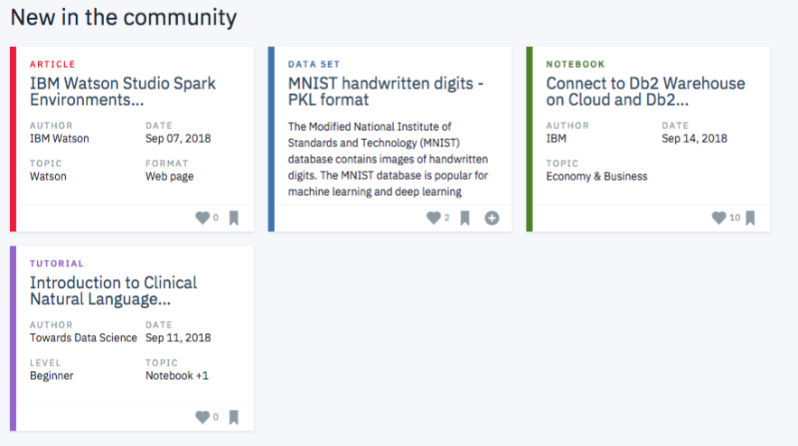

# Recommendations with IBM

### Introduction
This project focuses on analyzing interactions between users and articles on the IBM Watson Studio platform. New article recommendations are made to users based on their interactions. Based on the data available, we can use various methods to make these recommendations. The methods used here are Rank Based, Collaborative Filtering, and Matrix Factorization.

# Process
### Exploratory Data Analysis
This initial step is used to explore the data and extract descriptive statistics about the interactions. Also, visuals are provided to gain insights into the data and interactions.

**Insights:**
 - 50% of individuals interact with three articles or less
 - 45,993 total interactions between user and article
 - 364 reads by a single user
 - 937 views for article: "use deep learning for image classification"
 - 714 unique articles with at least one rating
 - 5148 unique users
 - 1051 unique articles

### Rank Based Recommendations
Since there are no ratings for articles the most popular articles are represented by their interactions with users. We only know if the user has or has not interacted with an article. We can simply count the amount of times an article was interacted with by users and proclaim it to be the most popular. This is especially useful for making recmomendations to *new users* for whom we have no existing data.

### User-User Collaborative Filtering
Finding similar users based on article interactions may lead to better and more personalized recommendations. First step is to create a user-item matrix where each row is a unique user and each column is a unique article. Each interaction is represented by a `1` which results in the creation of a sparse matrix. Similarity refers to a pair of users reading same articles. This involves identifying similar users, extracting the articles which they read, and recommending unique articles which were seen by one user but not the other. 

### Matrix Factorization
Here we can use the user-item matrix again to provide recommendations by performing Singular Value Decomposition (SVD). Using this method allows for predicting the user-article interaction. By breaking down the user-item matrix into a product of three matrices we can extract *latent features* (Sigma matrix) which indicate some relationship between the user and article. Predictions are made by varying the amount of latent features we choose to keep. In this case, it's a little tricky and discussed further in the Jupyter Notebook.

# Future Work
Perform Content Based recommendations using NLP methods; try other decomposition methods and compare results.

# Acknowledgements
[Udacity's](https://www.udacity.com) Data Science Nanodegree program

### See this project on [GitHub](https://github.com/Abdishakury/recommendations_with_IBM)
